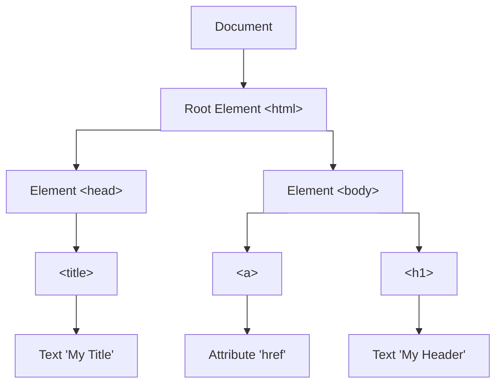

# JavaScript HTML DOM (Document Object Model)



## Accessing HTML Elements

The most common way to access HTML elements is to use the `id`.

```html
<html>
<body>

<p id="demo"></p>

<script>
// Access a paragraph Element
const myPara = document.getElementById("demo");

// Change the content of the Element
myPara.innerHTML = "Hello World!";
</script>

</body>
</html>
```

## DOM API 

### Selecting HTML Elements

| Method | Description |
| :--- | :--- |
| `document.getElementById(id)` | Find an element by element id |
| `document.getElementsByTagName(name)` | Find elements by tag name |
| `document.getElementsByClassName(name)` | Find elements by class name |
| `document.querySelector(selector)` | Find the first element that matches a CSS selector |
| `document.querySelectorAll(selector)` | Find all elements that match a CSS selector |

### Accessing Element Content

| Property | Description |
| :--- | :--- |
| `element.innerHTML` | The HTML content of an element |
| `element.textContent` | The text content of an element |

### Accessing Element Attributes

| Property | Description |
| :--- | :--- |
| `element.attribute` | Change the attribute value of an HTML element |
| `element.style.property` | The style of an HTML element |

> `document.getElementById("p2").style.color = "blue";`

### Changing Element Attributes

| Method | Description |
| :--- | :--- |
| `element.setAttribute()` | Create or set a new attribute |

### Manipulating Structure

| Method | Description |
| :--- | :--- |
| `document.createElement()` | Creates a new HTML element |
| `document.removeChild()` | Remove an HTML element |
| `document.appendChild()` | Add an HTML element |
| `document.replaceChild()` | Replace an HTML element |

### Adding Event Handlers

| Method | Description |
| :--- | :--- |
| `document.getElementById(id).onclick = function(){code}` | Adding event handler code to an onclick event |

### Form Validation

If a form field (fname) is empty, this function alerts a message, and returns false, to prevent the form from being submitted.
```html
<script>
"use strict";

function validateForm() {
  let x = document.forms["myForm"]["fname"].value;
  if (x == "") {
    alert("Name must be filled out");
    return false;
  }
} 

</script>

<form 
    name="myForm" 
    action="/action_page.php" 
    onsubmit="return validateForm()" 
    method="post"
>
Name: 
    <input type="text" name="fname">
    <input type="submit" value="Submit">
</form>
```

## Document References 

### Finding HTML Elements

| Method / Property | Description |
| :--- | :--- |
| `document.getElementById(id)` | Find an element by element id |
| `document.getElementsByTagName(name)` | Find elements by tag name |
| `document.getElementsByClassName(name)` | Find elements by class name |

### Changing HTML Elements

| Property / Method | Description |
| :--- | :--- |
| `element.innerHTML = new html content` | Change the inner HTML of an element |
| `element.attribute = new value` | Change the attribute value of an HTML element |
| `element.style.property = new style` | Change the style of an HTML element |
| `element.setAttribute(attribute, value)` | Change the attribute value of an HTML element |

### Adding and Deleting Elements

| Method | Description |
| :--- | :--- |
| `document.createElement(element)` | Create an HTML element |
| `document.removeChild(element)` | Remove an HTML element |
| `document.appendChild(element)` | Add an HTML element |
| `document.replaceChild(new, old)` | Replace an HTML element |
| `document.write(text)` | Write into the HTML output stream |

### Adding Events Handlers

| Method | Description |
| :--- | :--- |
| `document.getElementById(id).onclick = function(){...}` | Adding event handler code to an onclick event |

### Finding HTML Objects

| Property | Description |
| :--- | :--- |
| `document.anchors` | Returns all `<a>` elements that have a name attribute |
| `document.body` | Returns the `<body>` element |
| `document.documentElement` | Returns the `<html>` element |
| `document.embeds` | Returns all `<embed>` elements |
| `document.forms` | Returns all `<form>` elements |
| `document.head` | Returns the `<head>` element |
| `document.images` | Returns all `` elements |
| `document.links` | Returns all `<area>` and `<a>` elements that have a href attribute |
| `document.scripts` | Returns all `<script>` elements |
| `document.title` | Returns the `<title>` element |

## Element References 

### HTML DOM Element Properties and Methods

| Property / Method | Description |
| :--- | :--- |
| `addEventListener()` | Attaches an event handler to an element |
| `appendChild()` | Adds a new child node to an element, as the last child node |
| `attributes` | Returns a NamedNodeMap of an element's attributes |
| `blur()` | Removes keyboard focus from an element |
| `childElementCount` | Returns the number of child elements an element has |
| `childNodes` | Returns a collection of an element's child nodes (including text and comment nodes) |
| `children` | Returns a collection of an element's child elements (excluding text and comment nodes) |
| `classList` | Returns the class name(s) of an element, as a DOMTokenList object |
| `className` | Sets or returns the value of the class attribute of an element |
| `click()` | Simulates a mouse-click on an element |
| `clientHeight` | Returns the viewable height of an element in pixels |
| `clientLeft` | Returns the width of the left border of an element in pixels |
| `clientTop` | Returns the width of the top border of an element in pixels |
| `clientWidth` | Returns the viewable width of an element in pixels |
| `cloneNode()` | Clones an element |
| `closest()` | Searches the DOM tree for the closest element matching a CSS selector |
| `compareDocumentPosition()` | Compares the document position of two elements |
| `contains()` | Returns true if a node is a descendant of a specified node |
| `contentEditable` | Sets or returns whether the content of an element is editable |
| `dir` | Sets or returns the value of the dir attribute of an element |
| `firstChild` | Returns the first child node of an element |
| `firstElementChild` | Returns the first child element of an element |
| `focus()` | Gives focus to an element |
| `getAttribute()` | Returns the specified attribute value of an element node |
| `getAttributeNode()` | Returns the specified attribute node |
| `getBoundingClientRect()` | Returns the size of an element and its position relative to the viewport |
| `getElementsByClassName()` | Returns a collection of all child elements with the specified class name |
| `getElementsByTagName()` | Returns a collection of all child elements with the specified tag name |
| `hasAttribute()` | Returns true if an element has the specified attribute, otherwise false |
| `hasAttributes()` | Returns true if an element has any attributes, otherwise false |
| `hasChildNodes()` |Returns true if an element has any child nodes |

### HTML Element Methods & Properties

| Method / Property | Description |
| :--- | :--- |
| `accessKey` | Sets or returns the accesskey attribute of an element |
| `addEventListener()` | Attaches an event handler to the specified element |
| `appendChild()` | Adds a new child node to an element as the last child node |
| `attributes` | Returns a NamedNodeMap of an element's attributes |
| `blur()` | Removes keyboard focus from the current element |
| `childElementCount` | Returns the number of child elements an element has |
| `childNodes` | Returns a collection of an element's child nodes (including text and comment nodes) |
| `children` | Returns a collection of an element's child elements (excluding text and comment nodes) |
| `classList` | Returns the class name(s) of an element as a DOMTokenList object |
| `className` | Sets or returns the value of the class attribute of an element |
| `click()` | Simulates a mouse-click on an element |
| `clientHeight` | Returns the viewable height of an element in pixels (including padding, excluding borders and scrollbars) |
| `clientLeft` | Returns the width of the left border of an element in pixels |
| `clientTop` | Returns the width of the top border of an element in pixels |
| `clientWidth` | Returns the viewable width of an element in pixels (including padding, excluding borders and scrollbars) |
| `cloneNode()` | Clones an element |
| `closest()` | Searches the DOM tree for the closest ancestor matching a CSS selector |
| `compareDocumentPosition()` | Compares the document position of two elements |
| `contains()` | Returns true if a node is a descendant of a specified node |
| `contentEditable` | Sets or returns whether the content of an element is editable |
| `dir` | Sets or returns the text direction of an element |
| `firstChild` | Returns the first child node of an element |
| `firstElementChild` | Returns the first child element of an element |
| `focus()` | Gives focus to an element |
| `getAttribute()` | Returns the value of an element's attribute |
| `getAttributeNode()` | Returns the specified attribute node |
| `getBoundingClientRect()` | Returns the size of an element and its position relative to the viewport |
| `getElementsByClassName()` | Returns a collection of child elements with the specified class name |
| `getElementsByTagName()` | Returns a collection of child elements with the specified tag name |
| `hasAttribute()` | Returns true if an element has the specified attribute |
| `hasAttributes()` | Returns true if an element has any attributes |
| `hasChildNodes()` | Returns true if an element has any child nodes |
| `id` | Sets or returns the id of an element |
| `innerHTML` | Sets or returns the content of an element |
| `innerText` | Sets or returns the text content of a node and its descendants |
| `insertAdjacentElement()` | Inserts a given element node at a given position relative to the element |
| `insertAdjacentHTML()` | Parses specified text as HTML and inserts the resulting nodes into the DOM tree at a specified position |
| `insertAdjacentText()` | Inserts a given text node at a given position relative to the element |
| `insertBefore()` | Inserts a new child node before a specified existing child node |
| `isDefaultNamespace()` | Returns true if a specified namespaceURI is the default |
| `isEqualNode()` | Checks if two elements are equal |
| `isSameNode()` | Checks if two elements are the same node |
| `lang` | Sets or returns the language code of an element's text |
| `lastChild` | Returns the last child node of an element |
| `lastElementChild` | Returns the last child element of an element |
| `matches()` | Checks if an element matches a specified |
| `namespaceURI` | Returns the namespace URI of an element |
| `nextSibling` | Returns the next node at the same node level |
| `nextElementSibling` | Returns the next element at the same node level |
| `nodeName` | Returns the name of a node |
| `nodeType` | Returns the node type of a node |
| `nodeValue` | Sets or returns the value of a node |
| `offsetHeight` | Returns the height of an element including padding, border, and scrollbar |
| `offsetLeft` | Returns the horizontal offset position of an element |
| `offsetParent` | Returns the offset container of an element |
| `offsetTop` | Returns the vertical offset position of an element |
| `offsetWidth` | Returns the width of an element including padding, border, and scrollbar |
| `outerHTML` | Sets or returns the element and its content |
| `outerText` | Sets or returns the text content of the element and its descendants |
| `ownerDocument` | Returns the top-level document object for a node |
| `parentElement` | Returns the parent element node of an element |
| `parentNode` | Returns the parent node of an element |
| `previousSibling` | Returns the previous node at the same node level |
| `previousElementSibling` | Returns the previous element at the same node level |
| `querySelector()` | Returns the first child element that matches a specified CSS selector |
| `querySelectorAll()` | Returns all child elements that match a specified CSS selector |
| `removeAttribute()` | Removes a specified attribute from an element |
| `removeAttributeNode()` | Removes a specified attribute node and returns the removed node |
| `removeChild()` | Removes a child node from an element |
| `removeEventListener()` | Removes an event handler that has been attached with `addEventListener()` |
| `replaceChild()` | Replaces a child node in an element |
| `scrollHeight` | Returns the entire height of an element including padding |
| `scrollIntoView()` | Scrolls the specified element into the visible area of the browser window |
| `scrollLeft` | Sets or returns the number of pixels an element's content is scrolled horizontally |
| `scrollTop` | Sets or returns the number of pixels an element's content is scrolled vertically |
| `scrollWidth` | Returns the entire width of an element including padding |
| `setAttribute()` | Sets or changes the specified attribute to a specified value |
| `setAttributeNode()` | Sets or changes the specified attribute node |
| `style` | Sets or returns the value of the style attribute of an element |
| `tabIndex` | Sets or returns the tab order of an element |
| `tagName` | Returns the tag name of an element |
| `textContent` | Sets or returns the textual content of a node and its descendants |
| `title` | Sets or returns the title attribute of an element |
| `toString()` | Converts an element to a string |

--- 

# JavaScript HTML Events

Often, when events happen, you may want to do something.

When JavaScript is used in HTML pages, **JavaScript can react on events.**

JavaScript lets you execute code when events are detected.

HTML allows event handler attributes, **with JavaScript code**, to be added to HTML elements.

[HTML DOM Events](https://www.w3schools.com/jsref/dom_obj_event.asp)

## Event Listener 

Using event attributes like `onclick` are easy to use.

Nevertheless, using `addEventListener()` is the recommended way to handle events.

```html
<button id="myBtn">Click me</button>

<p id="demo"></p>

<script>
const btn = document.getElementById("myBtn");

// Add EventListener to btn
btn.addEventListener("click", function () {
  document.getElementById("demo").innerHTML = Date();
});
</script>
```

## Mouse Events

**Common Mouse Events**
* click
* dblclick
* mouseover / mouseout
* mousemove
* mousedown / mouseup

> Mouse events are crucial for interactive web pages and applications.
> Triggering specific functions in response to user actions.

## Load Events

**Load Events** happen when the browser has finished loading an element.

**Most Common:**
* DOMContentLoaded (when HTML is ready)
* load (waits fro pages, images, CSS, etc.)

**DOMContentLoaded**

The **DOMContentLoaded** event fires when the browser has fully loaded the HTML and built the Document Object Model (DOM) tree, 
but has not necessarily finished loading external resources like images and stylesheets.

The DOMContentLoaded event is **best for initializing the user interface**, 
attaching event handlers, and performing actions that only require the DOM to be ready.

```html
<p id="demo"></p>

<script>
// Add Event Listener to document
document.addEventListener("DOMContentLoaded", function () {
  document.getElementById("demo").innerHTML = "HTML is loaded!";
});
</script>
```

**Window Load (load)**

The **load** event fires when the entire page has fully loaded, 
including all dependent resources such as images, stylesheets, and sub-frames.

The load event is **best for actions that require all resources available**, 
such as getting the dimensions of an image or checking the browser type.

```html
<p id="demo"></p>

<script>
// Add Event Listener to window
window.addEventListener("load", function () {
  document.getElementById("demo").innerHTML = "Page is fully loaded!";
});
</script>
```

**Image Load**

```html


<p id="demo"></p>

<script>
const img = document.getElementById("myImg");

// Add Event Listener to img
img.addEventListener("load", function () {
  document.getElementById("demo").innerHTML = "Image loaded!";
});
</script>
```

## Event Management 

**Adding**
```html
<button id="btn">Click</button>

<p id="demo"></p>

<script>
const btn = document.getElementById("btn");

// Let btn listen for click
btn.addEventListener("click", myFunction);

function myFunction() {
  document.getElementById("demo").innerHTML = "Clicked!";
}
</script>
```

**Removing**
```html
<button id="add">Add</button>
<button id="remove">Remove</button>
<button id="test">Test click</button>

<p id="demo"></p>

<script>
const test = document.getElementById("test");
const remove = document.getElementById("remove");
const add = document.getElementById("add");

function myFunction() {
   document.getElementById("demo").innerHTML += "Hello!";
}

// Let add listen for click
add.addEventListener("click", function () {
  // Let test listen for click
  test.addEventListener("click", myFunction);
});

// Let remove listen for click
remove.addEventListener("click", function () {
  // Prevent test from listen for click
  test.removeEventListener("click", myFunction);
});
</script>
```

**Blocking**
```html
<a href="https://www.w3schools.com" id="link">Go to W3Schools</a>

<p id="demo"></p>

<script>
const link = document.getElementById("link");

// Let link listen for click
link.addEventListener("click", function (event) {
  event.preventDefault();
  document.getElementById("demo").innerHTML = "Link blocked!";
});
</script>
```